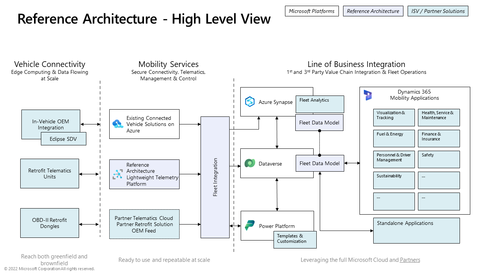

# Microsoft Connected Fleet Reference Architecture 

Welcome to the Microsoft Connected Fleet Reference Architecture.   The reference architecture is designed to demonstrate the integration from the vehicle through Azure & Dataverse with two main layers: the telemetry platform and the fleet integration layer:

| Layer |  Description  |
|---|---|
| **Vehicle Connectivity**  | Connectivity between device to cloud is supported through various patterns incluing Eclipse SDV, Embeded Telematics Control Units and OBD-II dongles.   Typically, these vehicle devices commuicate to the cloud using MQTT and/or HTTPS.    |
| **Mobility Services**  | The Mobility Serivces layers is responsible for handling hyper-scale secure connectivity, telemetry ingestion, command sending, etc. This layer handles everything from vehicle status updates to vehicle events, such as crashes, maintenance needs, and other critical events.  This layer also integrates with the Fleet Integration layer for communication into back-end services  |
| **Line of Business Integration**  | This layer receives information via the Fleet Integration Layer and stores the information into Azure Synapse, Data Verse (using Dynamics 365 Field Service) and can be extended using Dynamics 365 and/or Power Platform  |

The initial release of the Connected Fleet Reference Architecture is focused on 3 key components:

1. **Mobility Services Telemetry Platform** - a lightweight sample application to ingest MQTT data from the vehicle, parse and send to the Fleet Integration layer.   This sample is meant to be replaced with a fully functional Connected Vehicle/Fleet solution.

1. **Fleet Integration** - The ability to standardize the import of vehicle telemetry and vehicle events into Azure Synapse and the Microsoft DataVerse. This integration enables seamless connectivity from the vehicle all the way to business integration, providing real-time insights into fleet performance and productivity.

1. **Integration with Dynamics 365 Field Service** - Leveraging the out of box entities of D365 Field Service to store IoT Devices, Assets and Alerts for vehicle events.

## Capabilities available in this preview

This private preview provides the following capabilities

- Mobility Services Telemetry Platform.
  - Cloud based MQTT Broker.
  - Azure Functions to receive device to cloud messages and send Vehicle Events and Vehicle Status updates to the Fleet Integration Layer.
  - BICEP script templates to create the dependent components Azure.
- Fleet Integration Layer.
  - Event Hub to receive Vehicle Events and Vehicle Status updates.
  - Azure Function to connect into DataVerse and persist Vehicle Event Data.
  - Azure Data Explorer repository to save Vehicle Status updates and supporting Vehicle Event Data.
  - Azure Data Explorer Ingestion Function to parse incoming event hub data and persist into tables.
  - BICEP script templates to create the dependent components Azure.
- Dynamics 365 Field Service Integration.
  - Storing of Vehicle Event critical event data into D365 Field Service entities including IoT Assets, Devices and Alerts.

## Getting Started

To get started, please referring to the [Getting Started](./docs/GettingStarted.md) guide.

## Contributing

This project welcomes contributions and suggestions.  Most contributions require you to agree to a
Contributor License Agreement (CLA) declaring that you have the right to, and actually do, grant us
the rights to use your contribution. For details, visit https://cla.opensource.microsoft.com.

When you submit a pull request, a CLA bot will automatically determine whether you need to provide
a CLA and decorate the PR appropriately (e.g., status check, comment). Simply follow the instructions
provided by the bot. You will only need to do this once across all repos using our CLA.

This project has adopted the [Microsoft Open Source Code of Conduct](https://opensource.microsoft.com/codeofconduct/).
For more information see the [Code of Conduct FAQ](https://opensource.microsoft.com/codeofconduct/faq/) or
contact [opencode@microsoft.com](mailto:opencode@microsoft.com) with any additional questions or comments.

## Trademarks

This project may contain trademarks or logos for projects, products, or services. Authorized use of Microsoft 
trademarks or logos is subject to and must follow [Microsoft's Trademark & Brand Guidelines](https://www.microsoft.com/en-us/legal/intellectualproperty/trademarks/usage/general).
Use of Microsoft trademarks or logos in modified versions of this project must not cause confusion or imply Microsoft sponsorship.
Any use of third-party trademarks or logos are subject to those third-party's policies.
