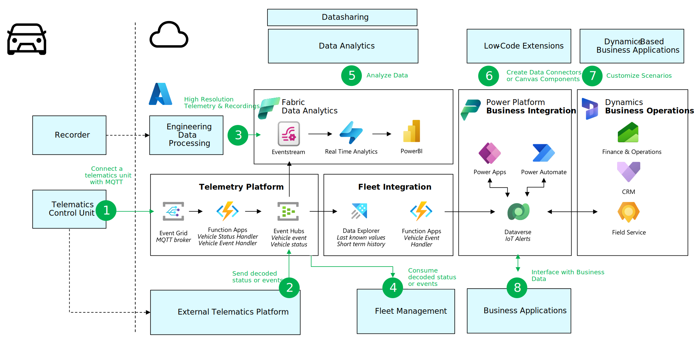

# Microsoft connected fleets reference architecture

Welcome to the Microsoft Connected Fleet Reference Architecture

This sample code implements the concepts described in the [automotive messaging, data & analytics](https://learn.microsoft.com/azure/event-grid/mqtt-automotive-connectivity-and-data-solution) and the [connected fleets](https://learn.microsoft.com/azure/architecture/industries/automotive/automotive-connected-fleets) reference architectures  in the Microsoft Learn website.

These reference architectures cover concepts such as:

- Telemetry platform to communicate to vehicles and devices
- Fleet integration to harmonize data and route messages to the right services
- Data analytics to create insights based on the vehicle and business data
- Business integration to provide customization using low-code / no-code
- Business operations for managing vehicles, devices, tasks and personnel.

The reference architecture also describes several integration points, where 3rd party applications can consume and share data.

## Available Capabilities

This sample code showcases the following elements:

1. **Mobility Services Telemetry Platform** - a lightweight sample application to ingest MQTT data from the vehicle, parse and send to the Fleet Integration layer. The functions can be customized to change the processing logic.

1. **Fleet Integration** - The ability to standardize the import of vehicle telemetry and vehicle events into Analytics and Business Integration.

1. **Integration with Dataverse, Power Platform and Dynamics 365 Field Service** - Leveraging the out of box entities of D365 Field Service to store IoT Devices, Assets and Alerts for vehicle events.

This sample code contains the follwing capabilities:

- Test client
  - Sample MQTT client that transmits telemetry for 5 test devices with realistic sample data per vehicle
- Mobility Services Telemetry Platform. 
  - Generation of test certificates for the broker and 5 test devices
  - Cloud based Event grid with the MQTT broker feature enabled with 5 sample clients preconfigured.
  - Azure Functions to process device to cloud messages for vehicle status and vehicle events.
  - Deployment script templates to create the dependent components Azure.
  - Event Hub to receive [Vehicle Events](./docs/EventMessages.md) and Vehicle Status updates.
- Fleet Integration.
  - Azure Data Explorer service to save Vehicle Status updates and supporting Vehicle Event Data.
  - Azure Data Explorer Ingestion Function to parse incoming event hub data and persist into tables.
  - Azure Function to connect into Dataverse and persist Vehicle Event Data.  
- Dynamics 365 Field Service Integration.
  - Storing of Vehicle Event critical event data into D365 Field Service entities including IoT Assets, Devices and Alerts.

## Getting Started

To get started, please referring to the [Getting Started](./docs/GettingStarted.md) guide.

## Contributing

This project welcomes contributions and suggestions.  Most contributions require you to agree to a
Contributor License Agreement (CLA) declaring that you have the right to, and actually do, grant us
the rights to use your contribution. For details, visit https://cla.opensource.microsoft.com.

When you submit a pull request, a CLA bot will automatically determine whether you need to provide
a CLA and decorate the PR appropriately (e.g., status check, comment). Simply follow the instructions
provided by the bot. You will only need to do this once across all repos using our CLA.

This project has adopted the [Microsoft Open Source Code of Conduct](https://opensource.microsoft.com/codeofconduct/).
For more information see the [Code of Conduct FAQ](https://opensource.microsoft.com/codeofconduct/faq/) or
contact [opencode@microsoft.com](mailto:opencode@microsoft.com) with any additional questions or comments.

## Trademarks

This project may contain trademarks or logos for projects, products, or services. Authorized use of Microsoft trademarks or logos is subject to and must follow [Microsoft's Trademark & Brand Guidelines](https://www.microsoft.com/en-us/legal/intellectualproperty/trademarks/usage/general).
Use of Microsoft trademarks or logos in modified versions of this project must not cause confusion or imply Microsoft sponsorship.
Any use of third-party trademarks or logos are subject to those third-party's policies.
