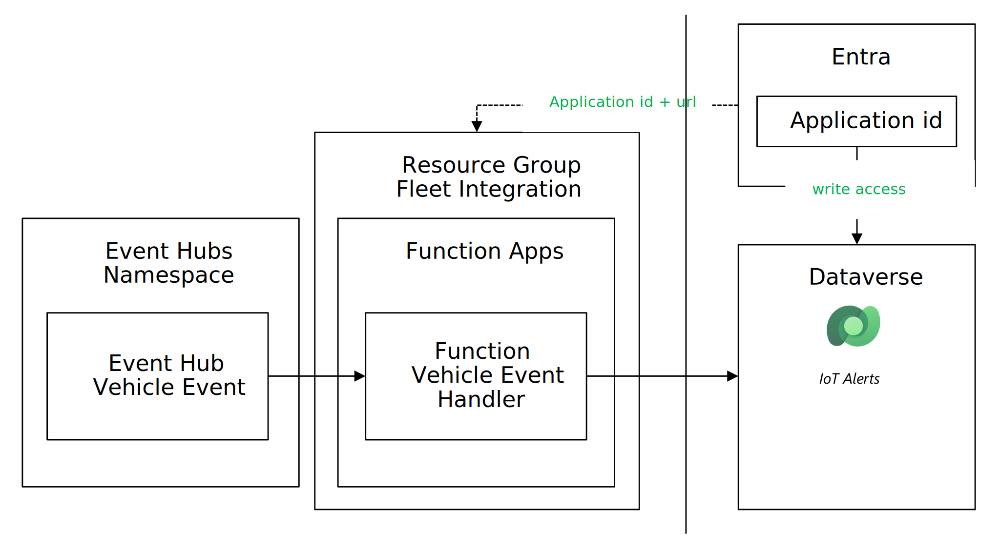

# Connecting to Dataverse and Dynamics Field Service

This document describes the fleet integration functions.



The Fleet Integration layer has one function

* VehicleEventHandler will process all device messages of type events and create an entry in the IoT Alert Table of the configured dataverse instance.

The function apps require the following configuration:

* Application id and secret with write access to the Dataverse instance
* Connection string (URI) to the dataverse

The setup procedure has 3 main steps:

1. Create an application registration in Entra ID with permissions to access the Common Data Service (Dataverse).
1. Add the application registration as a user in the Dataverse with the *Service Write* security role.
1. Configure and deploy the Function App.

## Prerequisites

* dotnet installed in the system
* Azure CLI installed
* Azure Functions Core Tools CLI installed

## Instructions

* Create an Application Registration with permissions to write to the Dataverse

  * Open Microsoft Entra ID in use by the Dataverse
  * Go to the App registrations blade
  * Click on *New Registration* on the toolbar
  * Use the following parameters to create the application registration
  
  | Key     | Value   |
  |---------|---------|
  | name | DynamicsServiceAccountApp |
  | Who can use this app | Microsoft only - single tenant |
  
  * Once created, go to the API permissions blade and add the permission "Dynamics CRM - Access Common Data Service as organization users"
  * Go to the blade "Certificates and Secrets" and create a new Client Secret. Note the value and the secret id.

* Add the application registration as a registered user to the dataverse.

  * Go to the [PowerPlatform administration console](https://admin.powerplatform.microsoft.com/home)
  * Open the blade *Environments* and select your environment.
  * Open *settings* in the toolbar.
  * Open the entry *Users + permissions* / *Application Users*
  * Select *New App user* on the toolbar
  * Select your created application registration *DynamicsServiceAccountApp*
  * Select the business unit (your selected organiyation id)
  * Add the security role *Service Writer*

* Change the directory to ```./src/FleetIntegration/Functions```

* Modify the configuration file. Open FunctionsConfig.json and add the following entries:

  | Key | Value |
  |-----|-------|
  | DataVerse_Secret | The Application registration secret value from the first step |
  | DataVerse_AppId | The Application registration id |
  | DataVerse_Uri | The uri of the dataverse. You can find it in the Power Platform admin center

* Export a variable with the name of the function app created in the telemetry platform

```bash
export fifunctionapp=$(az functionapp list --query "[].name" --resource-group ${RG_FLEETINTEGRATION} --output tsv)
```
* Set the configuration using the following command:

```bash
az functionapp config appsettings set --resource-group ${RG_FLEETINTEGRATION} --name ${fifunctionapp} --settings @FunctionsConfig.json
```

Deploy the function app to your function app instance using the following command

```bash
func azure functionapp publish ${fifunctionapp} --dotnet
```

After the command succeeds, you can check the functions deployed using the following command (replace name and resource group with your names)

```bash
     az functionapp function list --query "[].{name:name, resource:resourceGroup}" --name ${fifunctionapp} --resource-group ${RG_FLEETINTEGRATION} --output table
```

## Try it out

Use a MQTT Test Client to send Event Data. Event data will be stored in the dataverse as IoT Alerts, and the vehicle asset will be created if necessary.

You can monitor the execution of the function using the following command

```bash
func azure functionapp logstream ${fifunctionapp}
```

To see the IoT Events in the table

* Open Power Apps https://make.powerapps.com/
* Select your environment
* Select the blade *Tables*
* Select the option *All*
* In search, look for *IoT Alert*
* Select the table
