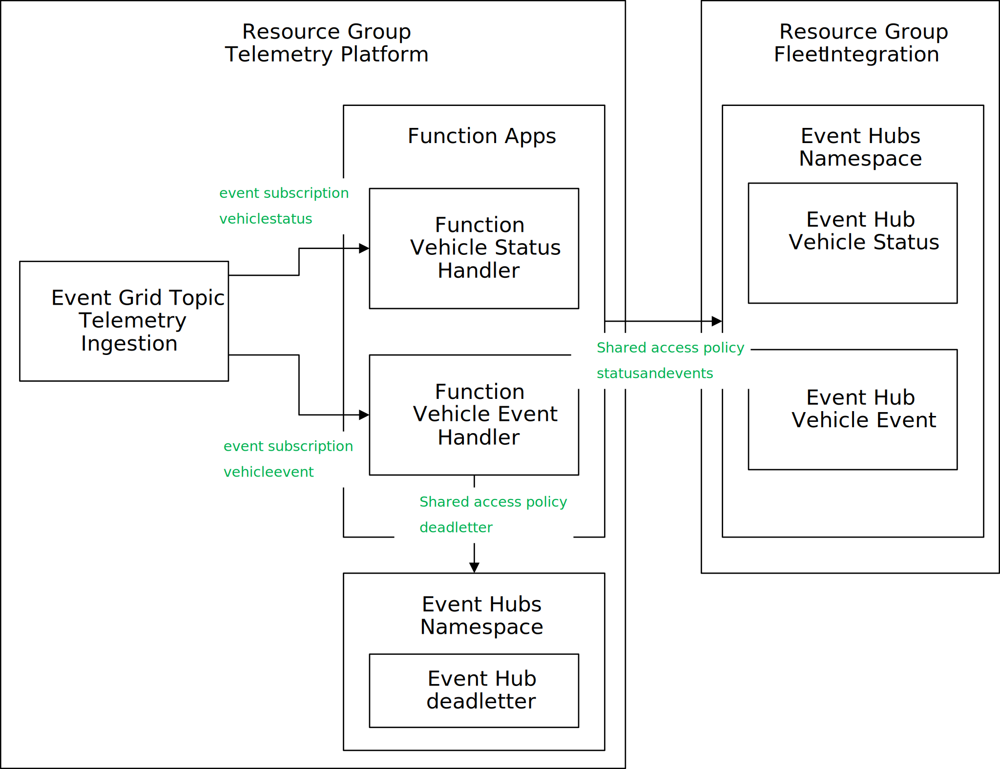

# Telemetry Platform Functions

This document describes the Azure Functions for the Telemetry Platform. These functions process vehicle telemetry (status and events).

Events are defined by a [JSON message that contains an id, the type of event](../../../docs/EventMessages.md), and associated metadata.



The Telemetry Platform has two functions

* VehicleStatusHandler will process signals posted to the +/vehiclestatus topic
* VehicleEventHandler will process signals posted to the +/vehiclevent topic

The function apps require the following configuration

* Input: Routing from the Event Grid MQTT broker functionality to the Function App
* Output:
  * Exceptions are stored in a *deadletter* event hub
  * Events are routed to an event hub for alerts & events in the *Fleet Integration* Layer
  * Status updates are routed to an event hub for periodical status updates in the *Fleet Integration* Layer

## Prerequisites

* dotnet installed in the system
* Azure CLI installed
* Azure Functions Core Tools CLI installed

## Instructions

* Change directory to the Telemetry Platform function app directory

```bash
    cd ./src/TelemetryPlatform/Functions
```

* Build the Functions from the terminal

```bash
    dotnet build
```

* Deploy the Functions to your Function app instance.

The following command shows you all of the function app resources deployed.

```bash
    az functionapp list --output table
```

A sample output looks like this

```bash
Name                     Location    State    ResourceGroup                        DefaultHostName                            AppServicePlan
-----------------------  ----------  -------  -----------------------------------  -----------------------------------------  ---------------------
functions-xxxxxxxxxxxxx  East US     Running  rg-fleetintegration                  functions-xxxxxxxxxxxxx.azurewebsites.net  appplan-xxxxxxxxxxxxx
functions-yyyyyyyyyyyyy  East US     Running  rg-telemetryplatform                 functions-yyyyyyyyyyyyy.azurewebsites.net  appplan-yyyyyyyyyyyyy

```

Please note the name of your function app "functions-yyyyyyyyyyyyy" in your *TelemetryPlatform* resource group. Deploy the function app to your function app instance using the following command

```bash
    func azure functionapp publish functions-yyyy --dotnet
```

After the command succeeds, you can check the functions deployed using the following command (replace name and resource group with your names)

```bash
     az functionapp function list --query "[].{name:name, resource:resourceGroup}" --name functions-yyyyyyyyyyyyy --resource-group rg-telemetryplatform --output table
```

* Configure the event hubs shared access policies that will be used by the Function Apps to publish the processed messages. You can list the Event Hub namespaces using the following command

```bash
    az resource list --resource-type "Microsoft.EventHub/namespaces" --output table
```

A sample output looks like this

```bash
Name              ResourceGroup                        Location    Type                           Status
----------------  -----------------------------------  ----------  -----------------------------  --------
eh-zzzzzzzzzzzzz  eg-fleetintegration                  eastus      Microsoft.EventHub/namespaces
eh-wwwwwwwwwwwww  eg-telemetryplatform                 eastus      Microsoft.EventHub/namespaces
```

The Event Hubs namespace in the telemetry platform is used for deadletter messages. It contains an Event Hubs instance called *deadletter*. Create a send Shared Access Policy at the namespace level with the name *deadletter* and a Send claim. Note the Connection string primary key.

You can use the following command to create the access policy in the Telemetry Platform layer (replace the namespace name and the resource group with your values):

```bash
az eventhubs namespace authorization-rule create --name deadletter --namespace-name eh-wwwwwwwwwwwww --resource-group eg-telemetryplatform  --rights Send
```

Use the following command to retrieve the primary connection string

```bash
az eventhubs namespace authorization-rule keys list --name deadletter --namespace-name eh-wwwwwwwwwwwww --resource-group eg-telemetryplatform
```

The Event Hubs namespace in the fleet integration platform is used to process status and events. It contains two Event Hubs instances, *vehicleevent* and *vehiclestatus*. Create a Shared Access Policy at the namespace level with the name *statusandevents* and a Send claim.  Note the Connection string primary key.

You can use the following command to create the access policy in the Fleet Integration layer (replace the namespace name and the resource group with your values):

```bash
az eventhubs namespace authorization-rule create --name statusandevents --namespace-name eh-zzzzzzzzzzzzz --resource-group eg-fleetintegration  --rights Send
```

Use the following command to retrieve the primary connection string

```bash
az eventhubs namespace authorization-rule keys list --name statusandevents --namespace-name eh-zzzzzzzzzzzzz --resource-group eg-fleetintegration
```

* Configure the Function Apps with the Event Hubs primary strings. In the function apps, go to the Environment Variables blade and add the following properties:

| Name                     | Value                  |
|--------------------------|------------------------|
| TelemetryPlatformEventHubConnectionString | add the connection string of the Telemetry Event Hub |
| VehicleStatusEventHubConnectionString | Add the connection string  if the Fleet Integration Event Hub |
| VehicleEventEventHubConnectionString | Add the connection string  if the Fleet Integration Event Hub |

Alternatively, you can set the values using the following sequence of commands (replace the names and end points with the right ones):

``` bash
az functionapp config appsettings set --name functions-yyyyyyyyyyyyy --resource-group eg-telemetryplatform --settings TelemetryPlatformEventHubConnectionString="Endpoint=<telemetry hub endpoint>"

az functionapp config appsettings set --name functions-yyyyyyyyyyyyy --resource-group eg-telemetryplatform --settings VehicleStatusEventHubConnectionString="Endpoint=<fleet integration hub endpoint>"

az functionapp config appsettings set --name functions-yyyyyyyyyyyyy --resource-group eg-telemetryplatform --settings VehicleEventEventHubConnectionString="Endpoint=<fleet integration hub endpoint>"
```

* Restart the Function App from the portal or using the following commmand (replace the values as appropiate)

```bash
az functionapp restart --name functions-yyyyyyyyyyyyy --resource-group eg-telemetryplatform 
```

## Verification

* Use the Test Client to send data. If the configuration is correct, the data will be processed by the Function Apps and land in the Event Hubs for the Fleet Integration. The Telemetry Platform is configured to send all messages to the Azure Data Explorer instance. You can also monitor the log files from the command line using the following command:

```bash
func azure functionapp logstream functions-yyyyyyyyyyyyy
```
